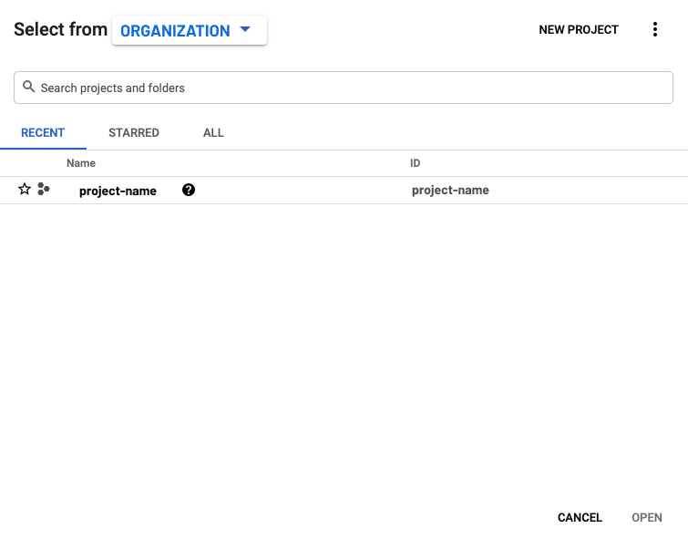
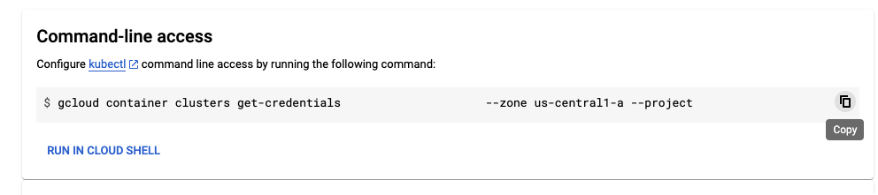

# Lab: Installing Istio

In this lab, we will install Istio on your Kubernetes cluster using the Istio operator.

## Prerequisites

To install Istio, we will need a running instance of a Kubernetes cluster. All cloud providers have a managed Kubernetes cluster offering we can use to install Istio service mesh.

We can also run a Kubernetes cluster locally on your computer using one of the following platforms:

- [Minikube](https://istio.io/latest/docs/setup/platform-setup/minikube/)
- [Docker Desktop](https://istio.io/latest/docs/setup/platform-setup/docker/)
- [kind](https://istio.io/latest/docs/setup/platform-setup/kind/)
- [MicroK8s](https://istio.io/latest/docs/setup/platform-setup/microk8s/)

When using a local Kubernetes cluster, make sure your computer meets the minimum requirements for Istio installation (e.g. 16384 MB RAM and 4 CPUs). Also, ensure the Kubernetes cluster version is v1.19.0 or higher.

The section that follow explain how to use Minikube or Kubernetes cluster on Google Cloud Platform.

## Using Minikube 

You can use Minikube with a Hypervisor. Hypervisor choice will depend on your operating system. To install Minikube and the Hypervisor, you can follow the [installation instructions](https://kubernetes.io/docs/tasks/tools/install-minikube/). 

Once we have installed Minikube, we can create and launch the Kubernetes cluster. The below command starts a Minikube cluster using VirtualBox hypervisor.

```bash
minikube start --memory=16384 --cpus=4 --driver=virtualbox
```

Make sure to replace the `--driver=virtualbox` with the name of the Hypervisor you're using. See the table below for available options.

| Flag name | More information |
| --- | --- |
| `hyperkit` | [HyperKit](https://github.com/moby/hyperkit) |
| `hyperv` | [Hyper-V](https://docs.microsoft.com/en-us/virtualization/hyper-v-on-windows/) | 
| `kvm2` | [KVM](https://www.linux-kvm.org/page/Main_Page) |
|`docker` | [Docker](https://hub.docker.com/search?q=&type=edition&offering=community&sort=updated_at&order=desc) |
| `podman` | [Podman](https://podman.io/getting-started/installation.html)
| `parallels` | [Parallels](https://www.parallels.com/) |
| `virtualbox` | [VirtualBox](https://www.virtualbox.org/) | 
| `vmware` | [VMware Fusion](https://www.vmware.com/products/fusion.html) | 

To check if the cluster is running, we can use the Kubernetes CLI and run the `kubectl get nodes` command:

```bash
$ kubectl get nodes
NAME       STATUS   ROLES    AGE    VERSION
minikube   Ready    master   151m   v1.19.0
```

>Note: if you installed Minikube using [Brew package manager](https://brew.sh), you also have Kubernetes CLI installed.

### Kubernetes CLI

If you need to install the Kubernetes CLI, follow [these instructions](https://kubernetes.io/docs/tasks/tools/install-kubectl/).

We can run `kubectl version` to check if the CLI is installed. You should see the output similar to this one:

```bash
$ kubectl version
Client Version: version.Info{Major:"1", Minor:"19", GitVersion:"v1.19.2", GitCommit:"f5743093fd1c663cb0cbc89748f730662345d44d", GitTreeState:"clean", BuildDate:"2020-09-16T21:51:49Z", GoVersion:"go1.15.2", Compiler:"gc", Platform:"darwin/amd64"}
Server Version: version.Info{Major:"1", Minor:"19", GitVersion:"v1.19.0", GitCommit:"e19964183377d0ec2052d1f1fa930c4d7575bd50", GitTreeState:"clean", BuildDate:"2020-08-26T14:23:04Z", GoVersion:"go1.15", Compiler:"gc", Platform:"linux/amd64"}
```

## Using Google Cloud Platform

The instructor will give you account information you can use to log into [Google Cloud Platform](https://cloud.google.com/).

After you've logged in click the Organization and Project dropdown on the top left of the screen as shown in the figure:


From the organization/project window select the organization (there should be only one) and then click the project name that shows up in the list of projects (there should also be only one project in the list).

Note that you might have to click the **ALL** tab to see the list of all projects and select the project from there.



Once you've selected the project and logged in, click the **Activate Cloud Shell** button on the top-right of the screen as shown in the figure below:


This is the terminal you will use to go through the labs.

### Connecting to the Kubernetes cluster

A Kubernetes cluster was provisioned for you. In order to connect to it from the Cloud Shell, you need to run a GCloud CLI command.

1. Click the hamburger button on the top left side of the screen.
1. From the Compute section, select **Kubernetes Engine** and click **Clusters**.

  

1. From the context menu (click the three dots), click the **Connect** button.
1. Under the Command-line access, click the **Copy** button to copy the gcloud command to your clipboard.

  

1. Paste the command to your cloud shell terminal to connect to the cluster.

You will also be prompted to authorize cloud shell - you can safely click the Authorize button.


To check if you're successfully connected to the cluster, you can run `kubectl get nodes` and you should see the output similar to this one:

```sh
user@cloudshell:~$ kubectl get nodes
NAME                                                 STATUS   ROLES    AGE   VERSION
project-name-default-pool-e46ed8ba-0sqm   Ready    <none>   23m   v1.18.17-gke.100
project-name-default-pool-e46ed8ba-vkdk   Ready    <none>   23m   v1.18.17-gke.100
project-name-default-pool-e46ed8ba-xr0n   Ready    <none>   23m   v1.18.17-gke.100
user@cloudshell:~$
```

## Install GetIstio CLI

The first step is to download GetIstio CLI. You can install GetIstio on macOS and Linux platforms. We can use the following command to download the latest version of GetIstio and certified Istio:

```sh
curl -sL https://tetrate.bintray.com/getistio/download.sh | bash
```

After installation completes, open a new tab terminal (click the + button in the top bar of the cloud shell).

We can now run the version command to ensure GetIstio is successfully installed. For example:

```sh
$ getistio version
getistio version: 1.0.5
active istioctl: 1.9.1-tetrate-v0
no running Istio pods in "istio-system"
1.9.1-tetrate-v0
```

The version command outputs the version of GetIstio, the version of active Istio CLI, and versions of Istio installed on the Kubernetes cluster.

## Install Istio

GetIstio communicates with the active Kubernetes cluster from the Kubernetes config file. Make sure you have the correct Kubernetes context selected (`kubectl config get-contexts`) before installing Istio.

The recommended profile for production deployments is the `default` profile. We will be installing the `demo` profile as it contains all core components, has a high level of tracing and logging enabled, and is meant for learning about different Istio features.

We can also start with the `minimal` component and individually install other features, like ingress and egress gateway, later.

To install the demo profile of Istio on a currently active Kubernetes cluster, we can use the `getistio istioctl` command like this:

```sh
getistio istioctl install --set profile=demo
```

GetIstio will check the cluster to make sure it is ready for Istio installation. Make sure you confirm the installation by when prompted by typing "y" and GetIstio will proceed with installation.

Once the installation completes you will see the following line in the output:

```sh
✔ Istio is installed and verified successfully
```

We can run the version comand again (`getistio version`). You’ll notice that the output shows the control plane and data plane versions installed on the cluster.

```sh
$ getistio version
getistio version: 1.0.5
active istioctl: 1.9.1-tetrate-v0
client version: 1.9.1-tetrate-v0
control plane version: 1.9.1-tetrate-v0
data plane version: 1.9.1-tetrate-v0 (2 proxies)
```

To check the status of the installation, we can look at the status of the Pods in the `istio-system` namespace:

```bash
$ kubectl get po -n istio-system
NAME                                    READY   STATUS    RESTARTS   AGE
istio-egressgateway-6db9994577-sn95p    1/1     Running   0          79s
istio-ingressgateway-58649bfdf4-cs4fk   1/1     Running   0          79s
istiod-dd4b7db5-nxrjv                   1/1     Running   0          111s
```

The operator has finished installing Istio when all Pods are running.

## Enable sidecar injection 

As we've learned in the previous section, service mesh needs the sidecar proxies running alongside each application.

To inject the sidecar proxy into an existing Kubernetes deployment, we can use `kube-inject` action in the `istioctl` command.

However, we can also enable automatic sidecar injection on any Kubernetes namespace. If we label the namespace with `istio-injection=enabled`, Istio automatically injects the sidecars for any Kubernetes Pods we create in that namespace. 

Let's enable automatic sidecar injection on the `default` namespace by adding a label:

```bash
$ kubectl label namespace default istio-injection=enabled
namespace/default labeled
```

To check the namespace is labeled, run the command below. The `default` namespace should be the only one with the value `enabled`.

```bash
$ kubectl get namespace -L istio-injection
NAME              STATUS   AGE   ISTIO-INJECTION
default           Active   32m   enabled
istio-operator    Active   27m   disabled
istio-system      Active   15m
kube-node-lease   Active   32m
kube-public       Active   32m
kube-system       Active   32m
```

We can now try creating a Deployment in the `default` namespace and observe the injected proxy. We will create a deployment called `my-nginx` with a single container using image `nginx`:

```
$ kubectl create deploy my-nginx --image=nginx
deployment.apps/my-nginx created
```

If we look at the Pods, you will notice there are two containers in the Pod:

```
$ kubectl get po
NAME                        READY   STATUS    RESTARTS   AGE
my-nginx-6b74b79f57-hmvj8   2/2     Running   0          62s
``` 

Similarly, describing the Pod shows Kubernetes created both an `nginx` container and an `istio-proxy` container:

```
$ kubectl describe po my-nginx-6b74b79f57-hmvj8
...
Events:
  Type    Reason     Age   From               Message
  ----    ------     ----  ----               -------
  Normal  Scheduled  28s   default-scheduler  Successfully assigned default/my-nginx-9b596c8c4-2v5d7 to gke-fico-may-2021-1-009-default-pool-e46ed8ba-0sqm
  Normal  Pulling    27s   kubelet            Pulling image "tetrate-docker-getistio-docker.bintray.io/proxyv2:1.9.1-tetrate-v0"
  Normal  Pulled     26s   kubelet            Successfully pulled image "tetrate-docker-getistio-docker.bintray.io/proxyv2:1.9.1-tetrate-v0"
  Normal  Created    26s   kubelet            Created container istio-init
  Normal  Started    25s   kubelet            Started container istio-init
  Normal  Pulling    25s   kubelet            Pulling image "nginx"
  Normal  Pulled     20s   kubelet            Successfully pulled image "nginx"
  Normal  Created    19s   kubelet            Created container nginx
  Normal  Started    19s   kubelet            Started container nginx
  Normal  Pulling    19s   kubelet            Pulling image "tetrate-docker-getistio-docker.bintray.io/proxyv2:1.9.1-tetrate-v0"
  Normal  Pulled     17s   kubelet            Successfully pulled image "tetrate-docker-getistio-docker.bintray.io/proxyv2:1.9.1-tetrate-v0"
  Normal  Created    17s   kubelet            Created container istio-proxy
  Normal  Started    17s   kubelet            Started container istio-proxy
```

To remove the deployment, run the delete command:

```bash
$ kubectl delete deployment my-nginx
deployment.apps "my-nginx" deleted
```

### Uninstalling Istio

To completely uninstall Istio from the cluster, run the following command:

```sh
getistio istioctl x uninstall --purge
```

## Installing Istio using IstioOperator

To get started we'll initialize the default Istio operator first. The init command deploys the operator to the `istio-operator` image and it configures it to watch the `istio-system` namespace. That means we'll have to create the IstioOperator resouce in the `istio-system` namespace so it gets picked up by the operator.

Let's initalize the operator first:

```sh
getistio istioctl operator init
```

Istio operator is deployed to the `istio-operator` namespace:

```sh
$ kubectl get po  -n istio-operator
NAME                              READY   STATUS    RESTARTS   AGE
istio-operator-7c67896564-jbcpf   1/1     Running   0          99s
```

Next, we can create the IstioOperator resource to install Istio. We'll use the default profile - that profile includes the `istiod` and an `istio-ingressgateway`:

```yaml
apiVersion: install.istio.io/v1alpha1
kind: IstioOperator
metadata:
  namespace: istio-system
  name: default-installation
spec:
  profile: default
```

Save the above to `default-installation.yaml` and create the resource with `kubectl apply -f default-installation.yaml`.

We can check the status of the installation by listing the Istio operator resource. The installation is completed once the STATUS column shows HEALTY:

```sh
$ kubectl get iop -A
NAMESPACE      NAME                   REVISION   STATUS        AGE
istio-system   default-installation              HEALTHY       67s
```

>Note: you can also look at the more detailed installation logs from the Istio operator pod.

### Updating the operator

To update the operator we can use kubectl and apply the updated IstioOperator resource. For example, if we wanted to include an egress gateway we could update the IstioOperator resource like this:

```yaml
apiVersion: install.istio.io/v1alpha1
kind: IstioOperator
metadata:
  namespace: istio-system
  name: default-installation
spec:
  profile: default
  components:
    egressGateways:
    - name: istio-egressgateway
      enabled: true
```

Save the above YAML to `iop-egress.yaml` and apply it to the cluster using `kubectl apply -f iop-egress.yaml`.

If you list the IstioOperator resource you'll notice the status has changed to `RECONCILING` and once the egress gateway is deployed, the status changes back to HEALTHY.

Another option for updating the Istio installation is to create separate IstioOperator resources. That way, you can have a resource for the base installation and separately apply different operators using an empty installation profile. For example, here's how you could create a separate IstioOperator resource that only deploys an internal ingress gateway:

```yaml
apiVersion: install.istio.io/v1alpha1
kind: IstioOperator
metadata:
  name: internal-gateway-only
  namespace: istio-system
spec:
  profile: empty
  components:
    ingressGateways:
      - namespace: some-namespace
        name: ilb-gateway
        enabled: true
        label:
          istio: ilb-gateway
        k8s:
          serviceAnnotations:
            networking.gke.io/load-balancer-type: "Internal"
```