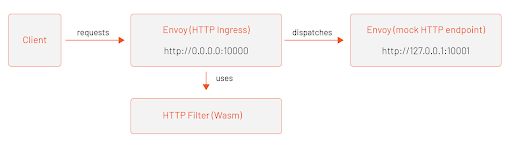

# Wasm Extensions

We will be using [GetEnvoy CLI](https://getenvoy.io) to initialize, build and test an Envoy Wasm module. Finally, we will show a way to configure the Wasm module using the EnvoyFilter resource and deploy it to Envoy sidecars in a Kubernetes cluster.

For our first example, we’ll start with something trivial and write a simple Wasm module using TinyGo that adds a custom header to response headers.

## Installing GetEnvoy CLI

Let's get started by downloading GetEnvoy CLI and installing it to `/usr/local/bin`:

```sh
curl -L https://getenvoy.io/cli | bash -s -- -b /usr/local/bin
```

Once downloaded, let's run it to make sure all is good:

```sh
$ getenvoy --version
getenvoy version 0.2.1-rc2
```

## Scaffolding the Wasm module

To initialize a new Wasm module, we can use the getenvoy extension init command. This command features a wizard that guides you through the process of initializing a new extension.

```sh
$ getenvoy extension init
What kind of extension would you like to create?
Use the arrow keys to navigate: ↓ ↑ → ←
? **Choose extension category:
  ▸ HTTP Filter
    Network Filter
    Access Logger**
```

Using the cursors keys, you can select one of the following module categories:

- HTTP Filter
- Network Filter
- Access Logger

Select the HTTP Filter and press Enter to continue.

Next, we need to decide which language we want to write the Wasm module in. The two options are Rust and TinyGo.

```sh
$ getenvoy extension init
What kind of extension would you like to create?
✔ Category HTTP Filter
Use the arrow keys to navigate: ↓ ↑ → ←
? **Choose programming language:
    Rust
  ▸ TinyGo**
```

Select TinyGo and press Enter to continue.

>Note: TinyGo is a project that allows us to produce WebAssembly code. It is a subset of the Go language and not everything is supported yet. You can check the list of packages supported by TinyGo here.

If you haven't invoked the command in an empty directory, you'll have to provide a directory where the module files will be generated. If you execute the `init` command from an empty folder, the CLI will skip the output directory selection.

In my case, I'll put my module into `/home/peter/header-filter` directory:

```sh
$ getenvoy extension init
What kind of extension would you like to create?
✔ Category HTTP Filter
✔ Language TinyGo
✔ Provide output directory: /home/peter/header-filter|
✔ Output directory **/home/peter/header-filter** 
```

Finally, you need to decide on the module name. The CLI will suggest a name using the following pattern: `[company-name].filters.[filter-type].[folder-name]`. With the folder and module type we selected, the suggested name is `mycompany.filters.http.header_filter`.

I'll change the name to `tetrate.filters.http.header_filter` and press Enter.

```sh
$ getenvoy extension init
What kind of extension would you like to create?
✔ Category HTTP Filter
✔ Language TinyGo
✔ Provide output directory: /home/peter/header-filter|
✔ Output directory /home/peter/header-filter
✔ Extension name tetrate.filters.http.header_filter
✔ Provide extension name: tetrate.filters.http.header_filter|
Great! Let me help you with that!
Scaffolding a new extension:
Generating files in /home/peter/header-filter:
✔ .getenvoy/extension/extension.yaml
✔ .gitignore
✔ go.mod
✔ go.sum
✔ main.go
✔ main_test.go
Done!

Hint:
Next time you can skip the wizard by running
  getenvoy extension init --category envoy.filters.http --language tinygo --name tetrate.filters.http.header_filter /home/peter/header-filter
```

The CLI will scaffold the new module in the provided folder. The folder contains the source code as well as the extension.yaml file that's used by the CLI.

## Setting additional headers on HTTP response

Let's open the `main.go` file and look through the code. This sample module already implements setting additional headers on the HTTP response.

Here's how headers are propagated from the rootContext, set on the httpContext, and finally set as HTTP response headers:

1. Root context gets created when the `newRootContext` function is called from the main function. This sets the `rootContextID` and the map with additional headers.
2. When a new HTTP request comes to the filter, the `NewHttpContext` function is called. This function creates an instance of an `httpContext`.
3. When response headers are being processed in `OnHttpResponseHeaders`, we iterate through the `additionalHeaders` map on the `httpContext` object and for each header name/value we call the `SetHttpResponseHeader` function.

Let's add another header to the `additionalHeaders` map in the `newRootContext` function:

```go
func newRootContext(rootContextID uint32) proxywasm.RootContext {
	return &rootContext{
       contextID: rootContextID, 
       additionalHeaders: map[string]string{"additional": "header", "hello": "world"}
  }
}
```

## Building the Wasm module

Because we are using the GetEnvoy CLI, we can build and run Wasm modules with ease. Let's build the module (the .wasm file) first, using the getenvoy extension build command. From the module root folder, run:

```sh
$ getenvoy extension build
Unable to find image 'getenvoy/extension-tinygo-builder:0.2.1-rc2' locally
0.2.1-rc2: Pulling from getenvoy/extension-tinygo-builder
cf4624f9a482: Pull complete
4188a7f566c8: Pull completed4ac7fbae4e8: Pull complete
ed009636d5a5: Pull complete
89e01905c793: Pull complete
6a715c2414fe: Pull complete
9e575dc059fc: Pull complete
Digest: sha256:33fcf5d165fb8fe798fdafaa872c9a30eb376b123b6eefec1d5039069e79400aStatus: Downloaded newer image for getenvoy/extension-tinygo-builder:0.2.1-rc2
go: downloading github.com/tetratelabs/proxy-wasm-go-sdk v0.1.0
```

If this is your first time running the build command, the GetEnvoy CLI will pull down the Docker image used for building the module and then build the module. The first build might take a while, especially if the Docker image needs to be pulled, but the subsequent builds will be much faster.
Once built, the extension.wasm file is copied to the build folder:

```sh
$ ls build/
extension.wasm
```

Eventually, we want to deploy this module as an EnvoyFilter to the Istio service mesh. However, let's see how we can run this outside of the cluster first.

## Running the Wasm module

To run the module we can use the `getenvoy extension run` command. We can specify the path to the extension.wasm file. The GetEnvoy CLI downloads the Envoy binary, generates a sample Envoy configuration, and starts the Envoy process in the foreground.

Let's run the command, but in the background, so we can make requests to the running Envoy instance. From the module root folder, run:

```sh
$ getenvoy extension run &
✔ .getenvoy/extension/examples/default/README.md
✔ .getenvoy/extension/examples/default/envoy.tmpl.yaml
✔ .getenvoy/extension/examples/default/example.yaml
✔ .getenvoy/extension/examples/default/extension.json
Done!
... [envoy logs] ...
```

As part of the run command, the GetEnvoy CLI creates an Envoy configuration that's used to demo the Wasm module. The demo configuration configures an HTTP ingress listener (listening on http://0.0.0.0:10000) that uses our module and dispatches all incoming requests to a mock HTTP endpoint, running on 127.0.0.1:10001. The mock service responds to all requests with HTTP status 200.

The figure below shows the request flow:



With the module running in the background, let's use curl to send a request to http://0.0.0.0:10000:

```sh
$ curl -v http://0.0.0.0:10000
* Expire in 0 ms for 6 (transfer 0x55ebd47b9fb0)
*   Trying 0.0.0.0...
* TCP_NODELAY set
* Expire in 200 ms for 4 (transfer 0x55ebd47b9fb0)
* Connected to 0.0.0.0 (127.0.0.1) port 10000 (#0)
> GET / HTTP/1.1
> Host: 0.0.0.0:10000
> User-Agent: curl/7.64.0
> Accept: */*
>
< HTTP/1.1 200 OK
< content-length: 22
< content-type: text/plain
< date: Wed, 21 Apr 2021 22:36:03 GMT
< server: envoy
< x-envoy-upstream-service-time: 1
**< additional: header
< hello: world**
<
Hi from mock service!
* Connection #0 to host 0.0.0.0 left intact
```

You will notice the two headers that were added by our Wasm module! Let's see how to deploy the module to all proxies running in the Istio service mesh.

## Deploying Wasm module to Istio using EnvoyFilter

The resource we can use to deploy a Wasm module to Istio is called the EnvoyFilter. EnvoyFilter gives us the ability to customize the Envoy configuration. It allows us to modify values, configure new listeners or clusters, and add filters.

In the previous example, there was no need to push or publish the extension.wasm file anywhere, as it was accessible by the Envoy proxy, because everything was running locally. However, now that we want to run the Wasm module in Envoy proxies that are part of the Istio service mesh, we need a way to make the extension.wasm file available to all those proxies so they can load and run it.

Since Envoy can be extended using filters, we can use the Envoy HTTP Wasm filter to implement an HTTP filter with a Wasm module. This filter allows us to configure the Wasm module and to load the module file.

Here's an a snippet that shows how to load a Wasm module using the Envoy HTTP Wasm filter:

```yaml
name: envoy.filters.http.wasm
typed_config:
  "@type": type.googleapis.com/envoy.extensions.filters.http.wasm.v3.Wasm
  config:
    config:
      name: "my_plugin"
      vm_config:
        runtime: "envoy.wasm.runtime.v8"
        code:
          local:
            filename: "/etc/envoy_filter_http_wasm_example.wasm"
        allow_precompiled: true
    configuration:
       '@type': type.googleapis.com/google.protobuf.StringValue
       value: |
         {}
```

This particular snippet is reading the Wasm file from the local path. Note that “local” in this case refers to the container the Envoy proxy is running in.

One way we could bring the Wasm module to that container is to use a persistent volume, for example. We'd then copy the Wasm file to the persistent disk and use the following annotations to mount the volume into the Envoy proxy sidecars:

```yaml
sidecar.istio.io/userMount: '[{"name": "wasmfilters", "mountPath": "/wasmfilters"}]'
sidecar.istio.io/userVolume: '[{"name": "wasmfilters", "gcePersistentDisk": { "pdName": "my-data-disk", "fsType": "ext4" }}]'
```

Note that the above snippet assumes a persistent disk running in GCP. This could be any other persistent volume as well. We'd then have to patch the existing Kubernetes deployments and 'inject' the above annotations.

Luckily for us there is another option. Remember the local field from the Envoy HTTP Wasm filter configuration? Well, there's also a remote field we can use to load the Wasm module from a remote location, a URL. This simplifies things a lot! We can upload the .wasm file to remote storage, get the public URL to the module, and then use it.

In this example I've uploaded my module to my GCP storage account and made the file publicly accessible.

The updated configuration would now look like this:

```yaml
vm_config:
  runtime: envoy.wasm.runtime.v8
  code:
    remote:
      http_uri:
        uri: [PUBLIC-URL]/extension.wasm
        sha256: "[sha]"
```

If you’re using Istio 1.9 or newer, you don’t have to provide the sha256 checksum, as Istio will fill that automatically. However, if you’re using Istio 1.8 or older, the sha256 checksum is required and it prevents the Wasm module from being downloaded each time. You can get the SHA by running sha256sum command.

You can use the commands below to copy the built extension to the Google Cloud Storage and make it publicly accessible:

```sh
BUCKET_NAME="[storage bucket name]"

# Copy the extension to the storage bucket
gsutil cp build/extension.wasm gs://$BUCKET_NAME

# Make the extension readable to all users
gsutil acl ch -u AllUsers:R gs://$BUCKET_NAME/extension.wasm
```

Here's how the EnvoyFilter resource that tells Envoy where to download the filter from looks like:

```yaml
apiVersion: networking.istio.io/v1alpha3
kind: EnvoyFilter
metadata:
  name: demo-extension-config
spec:
  configPatches:
  - applyTo: EXTENSION_CONFIG
    patch:
      operation: ADD
      value:
        name: demo-wasm-extension
        typed_config:
          "@type": type.googleapis.com/udpa.type.v1.TypedStruct
          type_url: type.googleapis.com/envoy.extensions.filters.http.wasm.v3.Wasm
          value:
            config:
              vm_config:
                vm_id: demo-wasm-extension-vm
                runtime: envoy.wasm.runtime.v8
                code:
                  remote:
                    http_uri:
                      uri: https://storage.googleapis.com/[bucket-name]/extension.wasm
```

Now that the filter is downloaded and optionally configured, we need a second EnvoyFilter to specify where in the filter chain we want to inject our Wasm module.

The second EnvoyFilter references the filter that was downloaded by the previous configuration  using the name `demo-wasm-extension`. It specifies where in the filter chain we want to inject our Wasm module.

```yaml
apiVersion: networking.istio.io/v1alpha3
kind: EnvoyFilter
metadata:
 name: demo-extension
spec:
 configPatches:
 - applyTo: HTTP_FILTER
   match:
     context: SIDECAR_INBOUND
     listener:
       filterChain:
         filter:
           name: envoy.filters.network.http_connection_manager
   patch:
     operation: INSERT_BEFORE
     value:
       name: demo-wasm-extension
       config_discovery:
         config_source:
           ads: {}
           initial_fetch_timeout: 0s # wait indefinitely to prevent bad Wasm fetch
         type_urls: [ "type.googleapis.com/envoy.extensions.filters.http.wasm.v3.Wasm"]
```

Note that we’re deploying the EnvoyFilters to default namespace. We could also deploy them to a root namespace (e.g. `istio-system`) in case we wanted to apply the filter to all workloads. Additionally, we could specify the selectors to pick the workloads to which we want to apply the filter.

The first EnvoyFilter (`demo-extension-config`) configures and downloads the Wasm module from the remote URI. The second EnvoyFilter (demo-extension) inserts the downloaded module into the filter chain. Note that we’re referring to the module in the second filter using the name `demo-wasm-extension` -- this is the name we specified in the first module as well.
Once you've updated the remote URI to your own module, save the both YAML listings above to `deploy-filter.yaml` and deploy it to a Kubernetes cluster with Istio installed:

```sh
$ kubectl apply -f deploy-filter.yaml
envoyfilter.networking.istio.io/demo-extension-config created
envoyfilter.networking.istio.io/demo-extension created
```

To try out the module, you can deploy a sample workload. 

Before you deploy the sample workload, make sure you've labeled the namespace with `istio-injection=enabled` label! 

I am using this httpbin example:

```yaml
apiVersion: v1
kind: ServiceAccount
metadata:
  name: httpbin
---
apiVersion: v1
kind: Service
metadata:
  name: httpbin
  labels:
    app: httpbin
    service: httpbin
spec:
  ports:
  - name: http
    port: 8000
    targetPort: 80
  selector:
    app: httpbin
---
apiVersion: apps/v1
kind: Deployment
metadata:
  name: httpbin
spec:
  replicas: 1
  selector:
    matchLabels:
      app: httpbin
      version: v1
  template:
    metadata:
      labels:
        app: httpbin
        version: v1
    spec:
      serviceAccountName: httpbin
      containers:
      - image: docker.io/kennethreitz/httpbin
        imagePullPolicy: IfNotPresent
        name: httpbin
        ports:
        - containerPort: 80
```

Save the above file to `httpbin.yaml` and deploy it using `kubectl apply -f httpbin.yaml`. 

Before continuing, check that the httpbin Pod is up and running:

```sh
$ kubectl get po
NAME                       READY   STATUS        RESTARTS   AGE
httpbin-66cdbdb6c5-4pv44   2/2     Running       1          11m
```

To see if something went wrong with downloading the Wasm module, you can look at the istiod logs.

Let's try out the deployed Wasm module! 

We will create a single Pod inside the cluster and from there we will send a request to `http://httpbin:8000/get`

```sh
$ kubectl run curl --image=curlimages/curl -it --rm -- /bin/sh
Defaulted container "curl" out of: curl, istio-proxy, istio-init (init)
If you don't see a command prompt, try pressing enter.
/ $
```

Once you get the prompt to the curl container, send a request to the `httpbin` service:

```sh
/ $ curl -v http://httpbin:8000/get
> GET /get HTTP/1.1
> User-Agent: curl/7.35.0
> Host: httpbin:8000
> Accept: */*
>
< HTTP/1.1 200 OK
< server: envoy
< date: Wed, 21 Apr 2021 23:57:09 GMT
< content-type: application/json
< content-length: 631
< access-control-allow-origin: *
< access-control-allow-credentials: true
< x-envoy-upstream-service-time: 5
**< additional: header
< hello: world**
<
```

Notice the two headers we defined in the Wasm module are being set in the response.

## How to configure Wasm modules

A fairly common development task is configuring your code, either through environment variables or configuration files.

To provide configuration for your Wasm module, you can use the configuration field under the config section:

```yaml
...
config:
  vm_config:
    vm_id: demo-wasm-extension-vm
    runtime: envoy.wasm.runtime.v8
    code:
      remote:
         http_uri:
          uri: [wasm module URI]
  configuration:
    '@type': type.googleapis.com/google.protobuf.StringValue
    value: |
        environment=prod
        user=peter
        debug=1 
...
```

The configuration settings from the above YAML are read and parsed in the `OnPluginStart` function:

1. We read the configuration data using GetPluginConfiguration function
2. We go through each line of the data
3. We parse the KEY=VALUE pairs and add them as headers to the `additionalHeaders` map

>Note: Typically you would use a JSON format for your configuration. However, TinyGo does not support a JSON library at the moment, so we fallback to using a key/value pair format.

You can now rebuild the module using getenvoy extension build and copy it to the remote URI defined in the EnvoyFilter YAML.

Since we've modified the configuration, we'll have to reapply the updated EnvoyFilter. Once that’s applied we can use the curl Pod again and make a request to `httpbin:8000/get`:

```sh
$ curl -v http://httpbin:8000/get
> GET /get HTTP/1.1
> User-Agent: curl/7.35.0
> Host: httpbin:8000
> Accept: */*
>
< HTTP/1.1 200 OK
< server: envoy
< date: Thu, 22 Apr 2021 22:35:54 GMT
< content-type: application/json
< content-length: 631
< access-control-allow-origin: *
< access-control-allow-credentials: true
< x-envoy-upstream-service-time: 3
< additional: header
< hello: world
< environment: prod
< user: peter
< debug: 1
...
```

The configuration values we set in the EnvoyFilter YAML are now being set as response headers by our Wasm module.