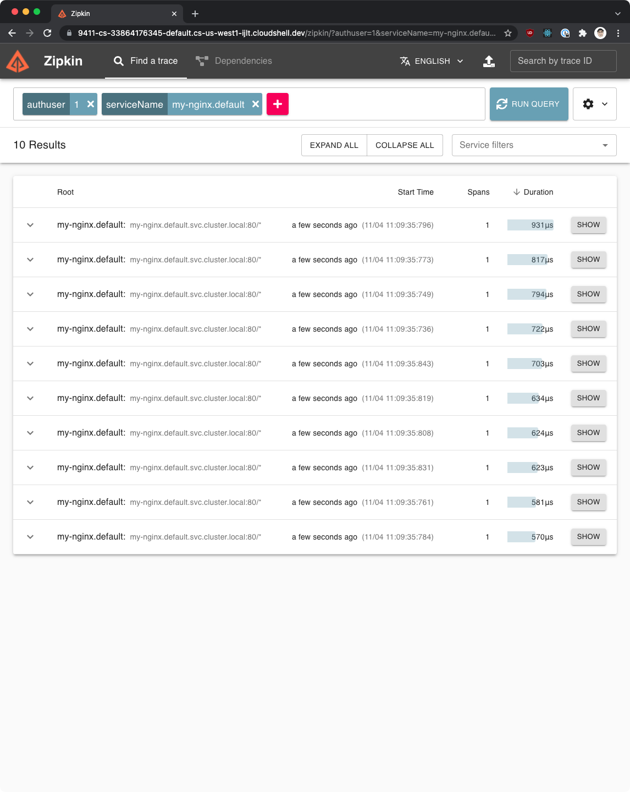

# Observability - Telemetry and Logs

In this module, we will learn about a couple of monitoring (Prometheus), tracing (Zipkin), and data visualization tools (Grafana).

For Grafana and Kiali to work, we will first have to install the Prometheus addon. Make sure you have Istio installed on your cluster. You can follow the [instructions here](./1-installing-istio.md).

## Deploying a sample app

To see some requests and traffic we will deploy an Nginx instance first.

```yaml
apiVersion: v1
kind: Service
metadata:
  name: my-nginx
  labels:
    app: my-nginx
spec:
  ports:
  - port: 80
    protocol: TCP
  selector:
    app: my-nginx
  type: LoadBalancer
---
apiVersion: apps/v1
kind: Deployment
metadata:
  name: my-nginx
spec:
  selector:
    matchLabels:
      app: my-nginx
  replicas: 1
  template:
    metadata:
      labels:
        app: my-nginx
    spec:
      containers:
      - name: nginx
        image: nginx
        ports:
        - containerPort: 80
```


Save the above YAML to `my-nginx.yaml` and create the deployment using `kubectl apply -f my-nginx.yaml`.

We have also deployed a my-nginx Kubernetes LoadBalancer service - this will allow us to generate some traffic to the `my-nginx` Pod.

>Note: later in the training we will learn how to use Istio resources and expose the services through Istios’ ingress gateway.

Now we can run `kubectl get services` and get the external IP address of the `my-nginx` service. Note that the load balancer creation might take a couple of minutes. During that time the value in the `EXTERNAL-IP` column will be `<pending>`.

```sh
$ kubectl get svc
NAME         TYPE           CLUSTER-IP   EXTERNAL-IP      PORT(S)        AGE
kubernetes   ClusterIP      10.48.0.1    <none>           443/TCP        73m
my-nginx     LoadBalancer   10.48.0.94   [IP HERE]   80:31191/TCP   4m6s
```

Once the IP address is available, let’s store it as an environment variable so we can use it throughout this lab:

```sh
export NGINX_IP=$(kubectl get service my-nginx -o jsonpath='{.status.loadBalancer.ingress[0].ip}')
```

You can now run curl against the above IP and you should get back the default Nginx page:

```sh
$ curl $NGINX_IP
<!DOCTYPE html>
<html>
<head>
<title>Welcome to nginx!</title>
<style>
    body {
        width: 35em;
        margin: 0 auto;
        font-family: Tahoma, Verdana, Arial, sans-serif;
    }
</style>
</head>
<body>
<h1>Welcome to nginx!</h1>
<p>If you see this page, the nginx web server is successfully installed and
working. Further configuration is required.</p>

<p>For online documentation and support please refer to
<a href="http://nginx.org/">nginx.org</a>.<br/>
Commercial support is available at
<a href="http://nginx.com/">nginx.com</a>.</p>

<p><em>Thank you for using nginx.</em></p>
</body>
</html>
```

## Looking at logs

You can make a couple of requests to the `$NGINX_IP` and then take a look at the logs from the `my-nginx` Pod, specifically the `istio-proxy` container. You can look at the logs using the `kubectl logs [pod_name] -c istio-proxy` command (replace the `pod_name` with the name of the Nginx pod on your cluster). 

Here’s a sample JSON log entry:

```json
{"response_code":200,"upstream_cluster":"inbound|80||","protocol":"HTTP/1.1","start_time":"2021-05-10T18:35:40.449Z","method":"GET","duration
":1,"user_agent":"curl/7.64.0","response_code_details":"via_upstream","authority":"35.230.126.202","upstream_service_time":"0","request_id":"
fde11243-0206-983c-bc60-b774c0886139","response_flags":"-","downstream_remote_address":"10.138.15.205:23950","route_name":"default","connecti
on_termination_details":null,"upstream_host":"127.0.0.1:80","upstream_local_address":"127.0.0.1:53330","bytes_received":0,"bytes_sent":612,"d
ownstream_local_address":"10.44.0.21:80","upstream_transport_failure_reason":null,"path":"/","x_forwarded_for":null,"requested_server_name":null}
```

## Prometheus

Prometheus is an open-source monitoring system and time series database. Istio uses Prometheus to record metrics that track the health of Istio and applications in the mesh.

[Here](https://istio.io/latest/docs/reference/config/metrics/) you can find the list of Istio standard metrics that are exported from the Envoy proxies.

To install Prometheus we can use the sample installation:

```sh
$ kubectl apply -f https://raw.githubusercontent.com/istio/istio/release-1.9/samples/addons/prometheus.yaml
serviceaccount/prometheus created
configmap/prometheus created
clusterrole.rbac.authorization.k8s.io/prometheus created
clusterrolebinding.rbac.authorization.k8s.io/prometheus created
service/prometheus created
deployment.apps/prometheus created
```

To open the Prometheus dashboard, we can use the dashboard command in the Istio CLI:

```sh
$ getistio istioctl dashboard prometheus
http://localhost:9090
```

We can now open http://localhost:9090 in a browser to get to the Prometheus dashboard, as shown in the figure below. If running in Google Cloud Shell, click the Web Preview icon in the top right corner to open your browser on a specific port.


Let's make a couple of requests to the $NGINX_IP environment variable we've created at the beginning. Then, from the Prometheus UI you can search for one of the Istio metrics (`istio_requests_total` for example) to get the idea on which data points are being collected.

Here's an example element from the Prometheus UI:

```sh
istio_requests_total{app="my-nginx",connection_security_policy="none",destination_app="my-nginx",destination_canonical_revision="latest",destination_canonical_service="my-nginx",destination_cluster="Kubernetes",destination_principal="unknown",destination_service="my-nginx.default.svc.cluster.local",destination_service_name="my-nginx",destination_service_namespace="default",destination_version="unknown",destination_workload="my-nginx",destination_workload_namespace="default",instance="10.44.2.9:15020",istio_io_rev="default",job="kubernetes-pods",kubernetes_namespace="default",kubernetes_pod_name="my-nginx-9b596c8c4-kdlpr",pod_template_hash="9b596c8c4",reporter="destination",request_protocol="http",response_code="200",response_flags="-",security_istio_io_tlsMode="istio",service_istio_io_canonical_name="my-nginx",service_istio_io_canonical_revision="latest",source_app="unknown",source_canonical_revision="latest",source_canonical_service="unknown",source_cluster="unknown",source_principal="unknown",source_version="unknown",source_workload="unknown",source_workload_namespace="unknown"}	8
```

## Grafana Dashboards

[Grafana](https://grafana.com) is an open platform for analytics and monitoring. Grafana can connect to various data sources and visualizes the data using graphs, tables, heatmaps, etc. With a powerful query language, you can customize the existing dashboard and create more advanced visualizations.

With Grafana, we can monitor the health of Istio installation and applications running in the service mesh.

We can use the `grafana.yaml` to deploy a sample installation of Grafana with pre-configured dashboards.

Ensure you deploy the Prometheus addon, before deploying Grafana, as Grafana uses Prometheus as its data source. 

Run the following command to deploy Grafana with pre-configured dashboards:

```bash
$ kubectl apply -f https://raw.githubusercontent.com/istio/istio/release-1.9/samples/addons/grafana.yaml
serviceaccount/grafana created
configmap/grafana created
service/grafana created
deployment.apps/grafana created
configmap/istio-grafana-dashboards created
configmap/istio-services-grafana-dashboards created
```

>This Grafana installation is not intended for running in production, as it's not tuned for performance or security.

Kubernetes deploys Grafana in the `istio-system` namespace. To access Grafana, we can use the `istioctl dashboard` command:

```bash
$ getistio istioctl dashboard grafana
http://localhost:3000
```

We can open `http://localhost:3000` in the browser to go to Grafana. Then, click Home and the **istio** folder to see the installed dashboards, as shown in the figure below.


The Istio Grafana installation comes pre-configured with the following dashboards:

1. Istio Control Plane Dashboard

From the Istio control plane dashboard, we can monitor the health and performance of the Istio control plane.


This dashboard will show us the resource usage (memory, CPU, disk, Go routines) of the control plane, and information about the pilot, Envoy,  and webhooks.

2. Istio Mesh Dashboard

The mesh dashboard provides us an overview of all services running in the mesh. The dashboard includes the global request volume, success rate, and the number of 4xx and 5xx responses.


3. Istio Performance Dashboard

The performance dashboard shows us the Istio main components cost in terms of resource utilization under a steady load.


4. Istio Service Dashboard

The service dashboard allows us to view details about our services in the mesh.

We can get information about the request volume, success rate, durations, and detailed graphs showing incoming requests by source and response code, duration, and size.


5. Istio Workload Dashboard

This dashboard provides us a detailed breakdown of metrics for a workload.


# Distributed Tracing with Zipkin

Zipkin is a distributed tracing system. We can easily monitor distributed transactions that are happening in the service mesh and discover any performance or latency issues.

For our services to participate in a distributed trace, we need to propagate HTTP headers from the services when making any downstream service calls. Even though all requests go through an Istio sidecar, Istio has no way of correlating the outbound requests to the inbound requests that caused them. By propagating the relevant headers from your applications, you can help Zipkin stitch together the traces.

Istio relies on B3 trace headers (headers starting with `x-b3`) and the Envoy-generated request ID (`x-request-id`). The B3 headers are used for trace context propagation across service boundaries.

Here are the specific header names we need to propagate in our applications with each outgoing request:

```text
x-request-id
x-b3-traceid
x-b3-spanid
x-b3-parentspanid
x-b3-sampled
x-b3-flags
b3
```

>If you're using Lightstep, you also need to forward the header called `x-ot-span-context`.

The most common way to propagate the headers is to copy them from the incoming request and include them in all outgoing requests made from your applications.

Traces you get with Istio service mesh are only captured at the service boundaries. To understand the application behavior and troubleshoot problems, you need to properly instrument your applications by creating additional spans.

To install Zipkin, we can use the `zipkin.yaml` file:

```
$ kubectl apply -f https://raw.githubusercontent.com/istio/istio/release-1.9/samples/addons/extras/zipkin.yaml
deployment.apps/zipkin created
service/tracing created
service/zipkin created
```

We can open the Zipkin dashboard by running `istioctl dashboard zipkin`. From the UI we can select the criteria for the trace lookups. Click the button and select `serviceName` and then `my-nginx.default` service from the dropdown and click the search button (or press Enter) to search the traces.



We can click on individual traces to dig deeper into the different spans. The detailed view will show us the duration of calls between the services, as well as the request details, such as method, protocol, status code, and similar. Since we only have 1 service running (Nginx), you won't see a lot of details. Later on, we will return to Zipkin and explore the traces in more details.


## Mesh Observability with Kiali

[Kiali](https://www.kiali.io/) is a management console for Istio-based service mesh. It provides dashboards, observability and lets us operate the mesh with robust configuration and validation capabilities. It shows the service mesh structure by inferring traffic topology and displays the health of the mesh. Kiali provides detailed metrics, powerful validation, Grafana access, and strong integration for distributed tracing with Jaeger.

To install Kiali, use the `kiali.yaml` file:

```
$ kubectl apply -f https://raw.githubusercontent.com/istio/istio/release-1.9/samples/addons/kiali.yaml
customresourcedefinition.apiextensions.k8s.io/monitoringdashboards.monito
ring.kiali.io created
serviceaccount/kiali created
configmap/kiali created
clusterrole.rbac.authorization.k8s.io/kiali-viewer created
clusterrole.rbac.authorization.k8s.io/kiali created
clusterrolebinding.rbac.authorization.k8s.io/kiali created
service/kiali created
deployment.apps/kiali created
```

Note that if you see any errors such as `no matches for kind "MonitoringDashboard" in version "monitoringkiali.io/v1alpha"`, re-run the `kubectl apply` command again. The issue is that there might be a race condition when installing the CRD (custom resource definition) and resources that are defined by that CRD.

We can open Kiali using `getistio istioctl dashboard kiali`.

Kiali can generate a service graph like the one in the figure below. 


The graph shows us the service topology and visualizes how the services communicate. It also shows the inbound and outbound metrics as well as traces by connecting to Jaeger and Grafana (if installed). Colors in the graph represent the health of the service mesh. A node colored red or orange might need attention. The color of an edge between components represents the health of the requests between those components. The node shape indicates the type of components,  such as services, workloads, or apps.

The health of nodes and edges is refreshed automatically based on the user’s preference. The graph can also be paused to examine a particular state, or replayed to re-examine a particular period.

Kiali provides actions to create, update, and delete Istio configuration, driven by wizards. We can configure request routing, fault injection, traffic shifting, and request timeouts, all from the UI. If we have any existing Istio configuration already deployed, Kiali can validate it and report on any warnings or errors.  