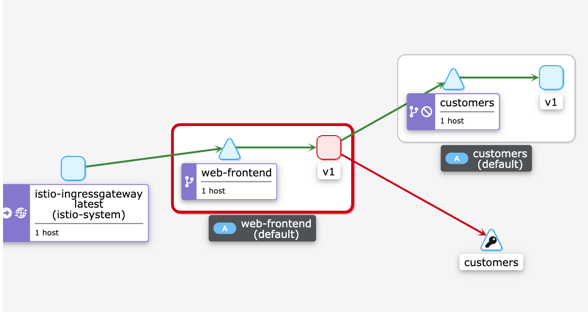

# Observing failure injection and delays in Grafana, Zipkin, and Kiali

In this lab, we will deploy the Web Frontend and Customers v1 service. We will then inject a failure, a delay, and observe both in Zipkin, Kiali, and Grafana.

Let's start by deploying the Gateway:

```yaml
apiVersion: networking.istio.io/v1alpha3
kind: Gateway
metadata:
  name: gateway
spec:
  selector:
    istio: ingressgateway
  servers:
    - port:
        number: 80
        name: http
        protocol: HTTP
      hosts:
        - '*'
```
>Note that we've set hosts to `*`. This way we can use the ingress gateway IP address directly, instead of adding the host header to each request.

Save the above YAML to `gateway.yaml` and create the Gateway using `kubectl apply -f gateway.yaml`.

Next, we will deploy the Web Frontend, Service, and VirtualService.

```yaml
apiVersion: apps/v1
kind: Deployment
metadata:
  name: web-frontend
  labels:
    app: web-frontend
spec:
  replicas: 1
  selector:
    matchLabels:
      app: web-frontend
  template:
    metadata:
      labels:
        app: web-frontend
        version: v1
    spec:
      containers:
        - image: gcr.io/tetratelabs/web-frontend:1.0.0
          imagePullPolicy: Always
          name: web
          ports:
            - containerPort: 8080
          env:
            - name: CUSTOMER_SERVICE_URL
              value: 'http://customers.default.svc.cluster.local'
---
kind: Service
apiVersion: v1
metadata:
  name: web-frontend
  labels:
    app: web-frontend
spec:
  selector:
    app: web-frontend
  ports:
    - port: 80
      name: http
      targetPort: 8080
---
apiVersion: networking.istio.io/v1alpha3
kind: VirtualService
metadata:
  name: web-frontend
spec:
  hosts:
    - '*'
  gateways:
    - gateway
  http:
    - route:
        - destination:
            host: web-frontend.default.svc.cluster.local
            port:
              number: 80
```

Save the above YAML to `web-frontend.yaml` and create the resources using `kubectl apply -f web-frontend.yaml`.

Lastly, we will deploy the Customers v1 and corresponding resources.

```yaml
apiVersion: apps/v1
kind: Deployment
metadata:
  name: customers-v1
  labels:
    app: customers
    version: v1
spec:
  replicas: 1
  selector:
    matchLabels:
      app: customers
      version: v1
  template:
    metadata:
      labels:
        app: customers
        version: v1
    spec:
      containers:
        - image: gcr.io/tetratelabs/customers:1.0.0
          imagePullPolicy: Always
          name: svc
          ports:
            - containerPort: 3000
---
kind: Service
apiVersion: v1
metadata:
  name: customers
  labels:
    app: customers
spec:
  selector:
    app: customers
  ports:
    - port: 80
      name: http
      targetPort: 3000
---
apiVersion: networking.istio.io/v1alpha3
kind: DestinationRule
metadata:
  name: customers
spec:
  host: customers.default.svc.cluster.local
  subsets:
    - name: v1
      labels:
        version: v1
---
apiVersion: networking.istio.io/v1alpha3
kind: VirtualService
metadata:
  name: customers
spec:
  hosts:
    - 'customers.default.svc.cluster.local'
  http:
    - route:
        - destination:
            host: customers.default.svc.cluster.local
            port:
              number: 80
            subset: v1
```

Save the above YAML to `customers.yaml` and create the resources using `kubectl apply -f customers.yaml`.

With the applications deployed, let's inject a 5-second delay to the Customers service for 50% of all requests. We will inject the delay in the `customers` VirtualService:

```yaml
apiVersion: networking.istio.io/v1alpha3
kind: VirtualService
metadata:
  name: customers
spec:
  hosts:
    - 'customers.default.svc.cluster.local'
  http:
    - route:
        - destination:
            host: customers.default.svc.cluster.local
            port:
              number: 80
            subset: v1
      fault:
        delay:
          percent: 50
          fixedDelay: 5s
```

Save above YAML to `customers-delay.yaml` and update the VirtualService using `kubectl apply -f customers-delay.yaml`.

To generate some traffic, let's open a separate terminal window and start making requests to the `GATEWAY_URL` in an endless loop:

```bash
while true; do curl http://$GATEWAY_URL/; done
```

>You can set the `GATEWAY_URL` variable like this:

  ```sh
  export GATEWAY_URL=$(kubectl get svc istio-ingressgateway -n istio-system -o jsonpath='{.status.loadBalancer.ingress[0].ip}')
  ```

We should start noticing some of the requests taking longer than usual. Let's open Grafana and observe these delays.

```bash
$ istioctl dash grafana
```

Open the URL in your browser, click **Home** and from the **istio** folder click the **Istio Service Dashboard**. On the dashboard, make sure to select the `web-frontend.default.svc.cluster.local` in the Service dropdown.

Expand the **Service Workloads** section and you will notice the increased duration on the **Incoming Request Duration by Service Workload** graph, as shown in the figure below. 


You can notice the same delay being reported in the **General** (client and server request duration graphs) and in the **Client Workloads** section (incoming request duration by source graph).

Let's see how this delay shows up in Zipkin. Open Zipkin with `istioctl dash zipkin`. On the main screen, select the `serviceName` and `web-frontend.default`, then add the `minDuration` criteria and enter `5s` and click the **Run query** button to find traces.

Click the Show button next to one of the traces to open the details page. On the details page, you will notice the total duration is a bit over 5 seconds. We will also see the `response_flags` tag set to `DI`. "DI" indicates that the request was delayed.


Let's update the VirtualService again and this time, we will inject a fault and return HTTP 500 for 50% of the requests.

```yaml
apiVersion: networking.istio.io/v1alpha3
kind: VirtualService
metadata:
  name: customers
spec:
  hosts:
    - 'customers.default.svc.cluster.local'
  http:
    - route:
        - destination:
            host: customers.default.svc.cluster.local
            port:
              number: 80
            subset: v1
      fault:
        abort:
          httpStatus: 500
          percentage:
            value: 50
```

Save the above YAML to `customers-fault.yaml` and update the VirtualService with `kubectl apply -f customers-fault.yaml`.

Just like before, we will start noticing failures from the request loop. 

Go back to Grafana and open the **Istio Mesh Dashboard**. Note how the global success rate has dropped as well as the graph showing 5xx responses.


From the same dashboard, we can click the `web-frontend.default` from the **Workload** column to open a dedicated dashboard for that workload.

Expand the **Outbound Services** and you'll notice a graph called "Outgoing Requests By Destination And Response Code". The graph will show a clear breakdown of HTTP 200 and HTTP 500 responses from the customers service.


There's a similar story in Zipkin. If we search for traces again (`serviceName=web-frontend.default`) we will notice the traces with errors will show up in red color (look at the duration column). Note that we can remove the `minDuration` from the query.


If you click Show next to the trace with an error you will notice the `response_flags` are set to `FI`, which stands for Failure Injection.

Let's also open Kiali (`istioctl dash kiali`) and look at the service graph by clicking the Graph link from the sidebar. You will notice how the `web-frontend` service has a red border, as shown below.



If we click on Graph and then the `web-frontend` service, we'll notice in the sidebar on the right the HTTP request details. The graph shows the percentage of success and failures. The success rate of outgoing requests is around 50%, which corresponds to the percentage value we set in the VirtualService.

## Cleanup

Delete the Deployments, Services, VirtualServices, DestinationRule, and the Gateway:

```bash
kubectl delete deploy web-frontend customers-v1
kubectl delete svc customers web-frontend
kubectl delete vs customers web-frontend
kubectl delete dr customers
kubectl delete gateway gateway
```